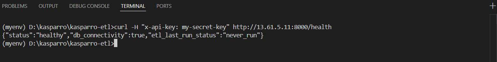
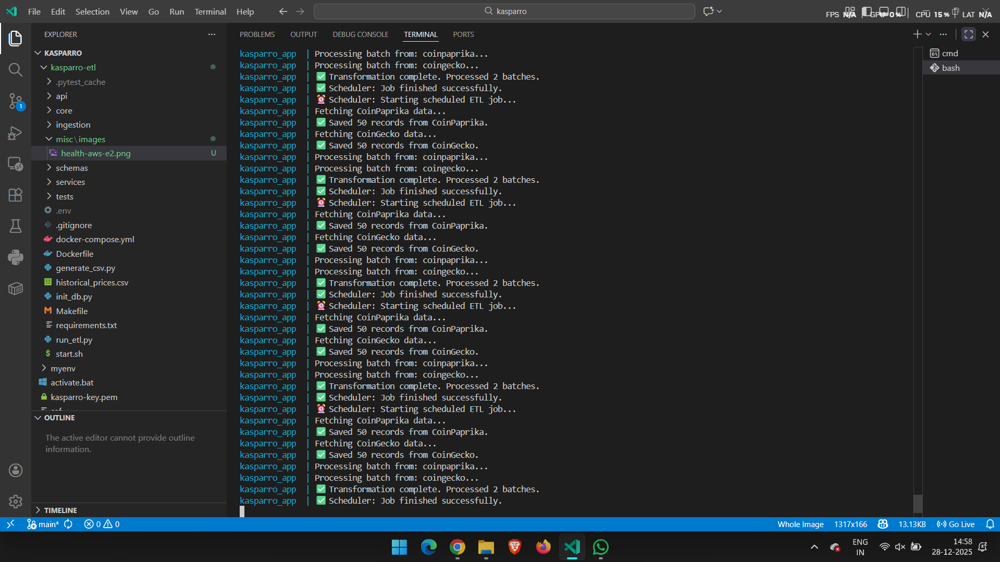
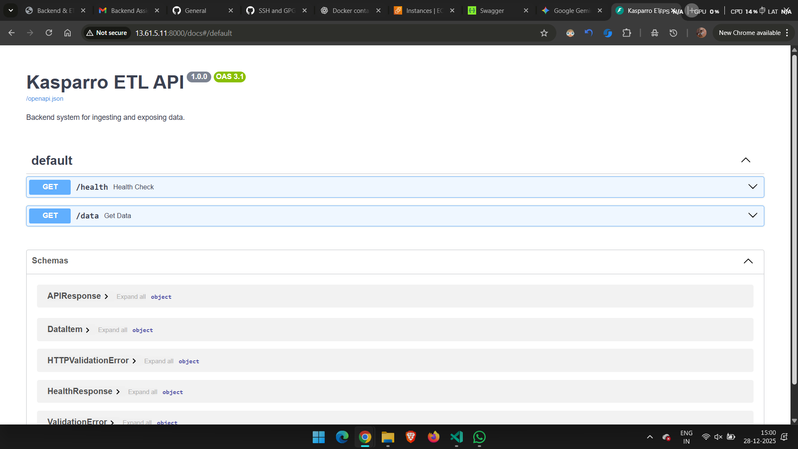

# Kasparro Backend & ETL System

## Overview
This project is a production-grade backend system designed to ingest, normalize, and expose data from multiple sources. It was built as part of the Kasparro Backend Engineering assignment. The system features a robust ETL pipeline, a secure FastAPI backend, and an automated scheduler, all containerized with Docker and deployed to AWS EC2.

## Architecture & Design
The system follows a "Clean Architecture" pattern to ensure modularity and testability:
* **ingestion/**: Contains the logic for extracting data from external APIs (CoinPaprika, CoinGecko) and CSV files.
* **core/**: Manages database connections and SQLAlchemy models.
* **schemas/**: Uses Pydantic V2 models for strict type validation and data normalization.
* **api/**: Defines the REST API endpoints and dependency injection for security.
* **services/**: Hosts the background scheduler that triggers ETL jobs.

## Features Implemented

### P0 - Foundation Layer
* **Data Ingestion**: Successfully ingests data from two API sources and one CSV source.
* **Storage**: Stores raw data in PostgreSQL (JSONB) to preserve the source of truth, and normalizes it into a `unified_data` schema.
* **API Service**: Exposes `/data` and `/health` endpoints.
* **Docker Automation**: Entire system runs via `make up`.

### P1 - Growth Layer
* **Three Data Sources**: CoinPaprika (API), CoinGecko (API), and Historical CSV.
* **Incremental Ingestion**: Implemented a checkpointing mechanism to track the last run state and prevent duplicate processing.
* **Stats Endpoint**: Added `/stats` to provide visibility into ETL run metrics.
* **Comprehensive Testing**: Added a Pytest suite covering API endpoints and transformation logic.

### P2 - Differentiator Layer
* **P2.5 DevOps**: Implemented a GitHub Actions CI pipeline that automatically builds and tests the application on every push to the main branch.

## Tech Stack
* **Language**: Python 3.11
* **Framework**: FastAPI
* **Database**: PostgreSQL 15
* **Validation**: Pydantic V2
* **Infrastructure**: Docker & Docker Compose
* **Cloud Provider**: AWS EC2 (Ubuntu)

## Setup & Installation

### Prerequisites
* Docker and Docker Compose (v2)
* Make

### Environment Variables
Create a file named `.env` in the root directory with the following configuration:
```
POSTGRES_USER=user
POSTGRES_PASSWORD=password
POSTGRES_DB=kasparro_etl
POSTGRES_HOST=db
POSTGRES_PORT=5432
API_KEY=your_secret_key
COINPAPRIKA_API_KEY=your_coinpaprika_key
```
### Running the System
The system is fully automated using a Makefile.

1. Start the application (API + Scheduler + Database):
   make up

2. Run the automated test suite:
   make test

3. Stop the application:
   make down

## API Documentation
The API is secured using a custom header `x-api-key`.

* **Base URL**: http://13.61.5.11:8000
* **Interactive Documentation (Swagger UI)**: http://13.61.5.11:8000/docs

### Endpoints
* **GET /health**: Checks database connectivity and reports the last ETL run status.
* **GET /data**: Retrieves normalized data with pagination and filtering.
    * Query Params: `page`, `limit`, `source`
    * Headers: `x-api-key` required.
* **GET /stats**: Returns summary metrics of total records processed.

## 🧪 Quick Test (Curl)
You can test the live API immediately using the following commands.

### 1. Check System Health (No Auth Required)
```bash
curl [http://13.61.5.11:8000/health](http://13.61.5.11:8000/health)
```

### 2. Fetch Data (Requires Auth)

```bash
curl -H "x-api-key: "add_api_key_from_mail" [http://13.61.5.11:8000/data?limit=5]"
```

## Verification & Screenshots

### 1. API Health Check
Demonstration of the system running live on AWS EC2.


### 2. ETL Scheduler Logs
Evidence of the background ETL job running and processing data successfully.


### 3. Swagger UI
Visual confirmation of the API documentation and data endpoints.


## Deployment
The system is deployed on an AWS EC2 instance (Ubuntu 24.04).
* Port 8000 is exposed for API traffic.
* Docker Compose manages the lifecycle of the application and database containers.
* A GitHub Actions workflow ensures continuous integration by running tests on every commit.